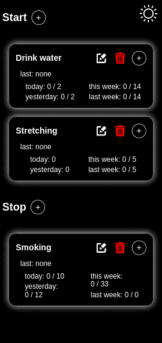
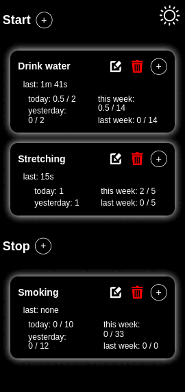

# Track App

## Overview

The **Track App** is a application designed to help users track their goals and activities. It utilizes IndexedDB for data storage, allowing for efficient management of user data. An Android APK file is available.

## Features

-   **Goal Tracking**: Users can set and track daily and weekly goals.
-   **Data Persistence**: Utilizes IndexedDB for storing user data locally.
-   **Responsive Design**: Works seamlessly on both desktop and mobile devices.
-   **Theme Support**: Light and dark mode themes for user preference.

## Installation

You can view the live demo on [GitHub Pages](https://gijs-d.github.io/Track-App/).

To run the Track App locally, follow these steps:

1. Clone the repository:
    ```bash
    git clone https://github.com/gijs-d/Track-App.git
    ```
2. Navigate to the project directory:
    ```bash
    cd Track-App
    ```
3. Open index.html in your web browser.

## Using the Android APK

To install and use the Track App on your Android device, follow these steps:

1. **Download the APK**: Download the APK file `track.apk`.

2. **Enable Unknown Sources**:

    - Go to your device's **Settings**.
    - Navigate to **Security** or **Apps & notifications**.
    - Enable **Install unknown apps** for the browser or file manager you will use to install the APK.

3. **Install the APK**:

    - Locate the downloaded APK file using a file manager.
    - Tap on the APK file to begin the installation process.
    - Follow the on-screen instructions to complete the installation.

4. **Open the App**: Once installed, you can find the Track App in your app drawer. Tap the icon to launch the app.

## Usage

-   **Adding Goals**: Click the \"+\" button to add a new goal. Fill in the required fields and submit the form.
-   **Viewing Goals**: Goals are displayed in a list format, showing the current status and history.
-   **Editing Goals**: Click the edit button next to a goal to modify its details.
-   **Deleting Goals**: Use the delete button to remove a goal from the list.

## Screenshots





